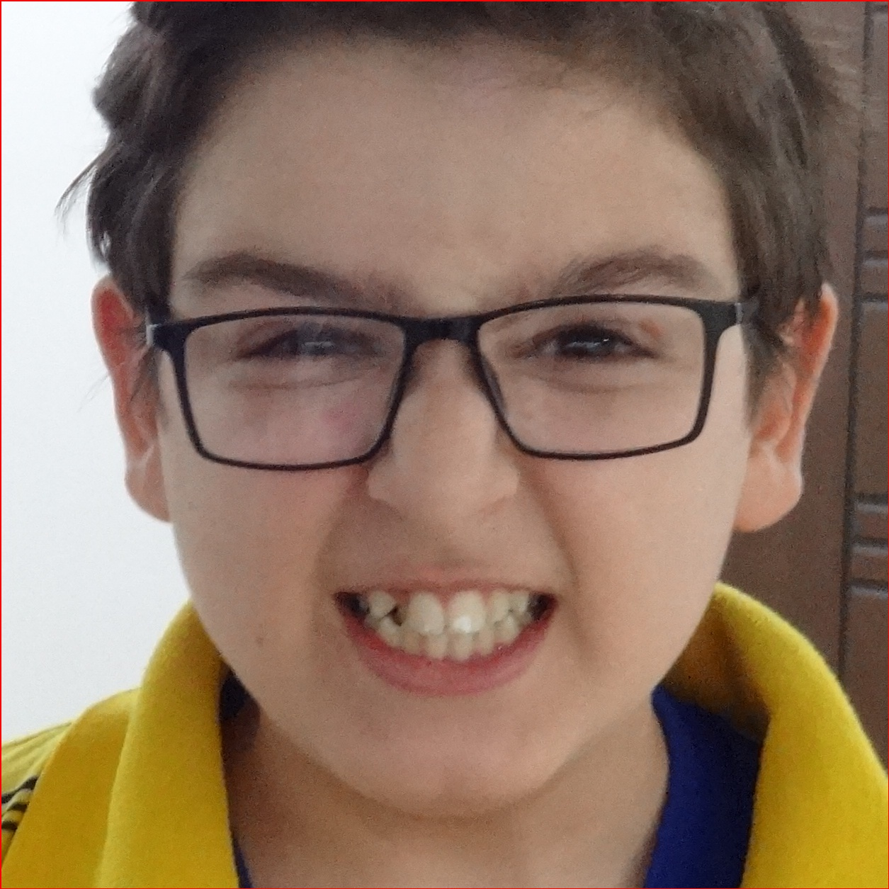
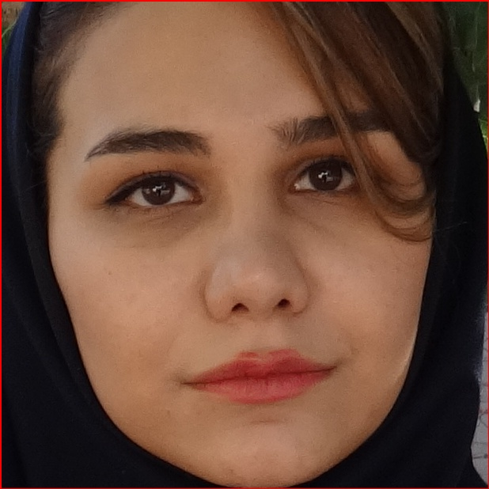
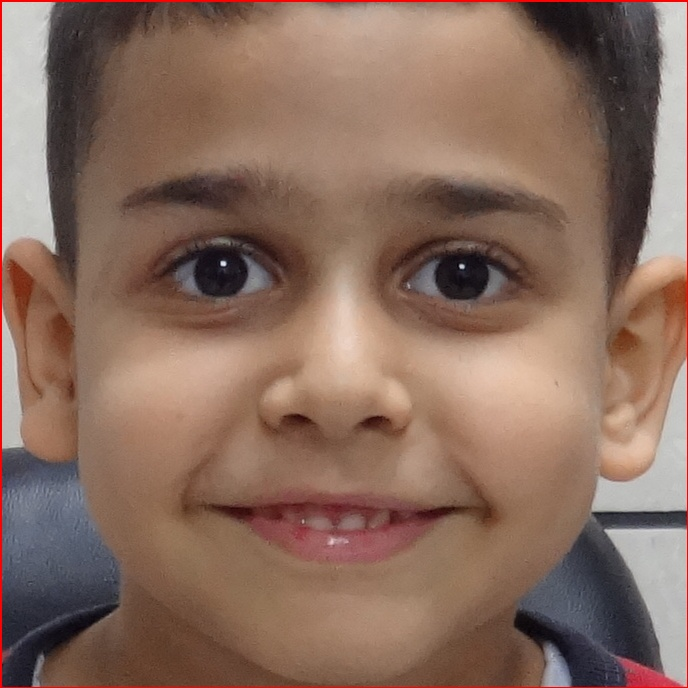
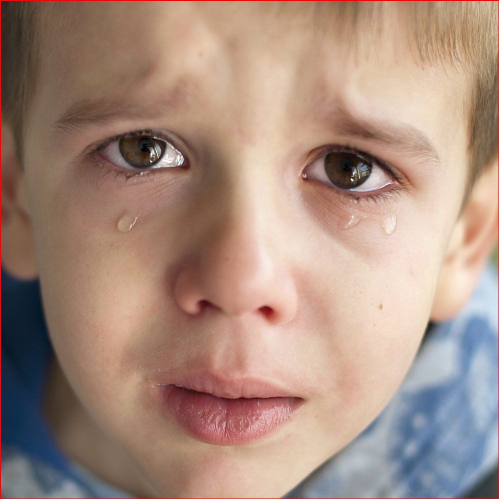
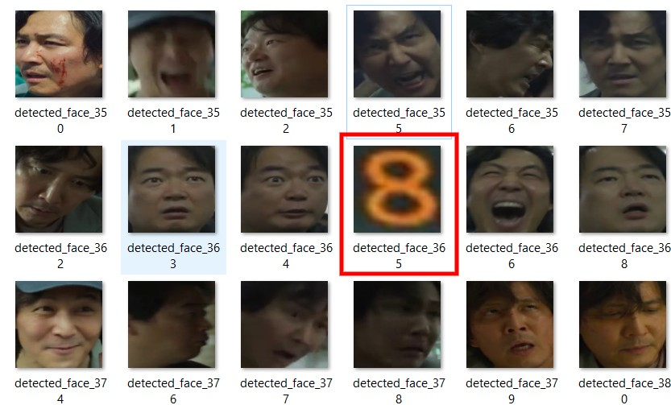

# Persian Facial Emotion Recognition using Deep Learning

## Introduction

This project aims to explore deep learning techniques for facial emotion recognition. While nationality-specific differences are not a primary concern, the project aims to implement and test various deep learning methods, including self-supervised and transfer learning, to achieve good facial emotion classification and enhance understanding of deep learning through practical experience.
## Project Overview

- **Data Collection**: A large number of sample frames from videos were extracted, and the MTCNN model was used for human face detection, resulting in a dataset of human face images.

- **Transfer Learning for Face Detection**: Using pre-trained model 'Inception-ResNetV2' for accurate face detection, ensuring high-quality face images for subsequent tasks.

- **Self-Supervised Learning**: Utilizing pretext tasks like jigsaw puzzles and rotation, pre-trained the model on the collected images.

- **Customized Dataset**: Standard photos of Persian human faces were gathered, with four emotion categories (happy, sad, neutral, and angry) for each individual. This dataset contains images from just 15 individuals.

- **Fine-tuning**: The pre-trained model was fine-tuned on the customized dataset to improve its performance in Persian human face emotion recognition.

## Project Workflow

1. **Face Detection**: The MTCNN model was used for initial face detection. Subsequently, an Inception-ResNet model was fine-tuned for accurate face detection, ensuring high-quality face images.

2. **Data Refinement**: Non-human faces were filtered out by comparing results from both MTCNN and the fine-tuned face detection model, ensuring a dataset of genuine human faces.

3. **Self-Supervised Learning**: Self-supervised learning techniques, including two pretext tasks, jigsaw puzzles, and rotation, were implemented to pre-train the model on the refined dataset.

4. **Emotion Recognition**: The pre-trained model of the last part was trained for facial emotion recognition using the customized dataset.

5. **Evaluation**: The performance of the emotion recognition models was assessed, including metrics and insights.

## Project Goals

The key goals of this project include:

1. **Comprehensive Deep Learning Exploration**: Conduct a complete deep learning project from data collection to model development, gaining practical experience in data preparation, preprocessing the data, and advanced deep learning techniques.

2. Transfer Learning for Face Detection: Implement transfer learning to fine-tune a model for accurate face detection. The results were combined with MTCNN, and if either model predicts an image as a non-human face, that image is removed from the facial dataset.

3. **Self-Supervised Learning**: Utilize self-supervised learning techniques to pretrain models, gaining insights into their effectiveness in improving feature representations.

4. **Iranian Facial Emotion Recognition**: Train and evaluate deep learning models for facial emotion recognition, providing insights into their performance on the refined data.

## Customized Dataset 

samples of the customized dataset: 

|     angry     |    neutral    |     happy     |      sad      |
| ------------- | ------------- | ------------- | ------------- |
|   |   |   |   |

## Face Verification

Faces detected by MTCNN, which include a non-face image, were removed by the fine-tuned Inception-ResNet model, which predicted it as a non-facial image:
  

## Permissions
For preparing the customized dataset, photos were taken in a **hospital** with the permission of the people to share, take, and use their facial photos for this project. All the individuals whose photos we have taken, have granted us permission to share and utilize them for this project.

